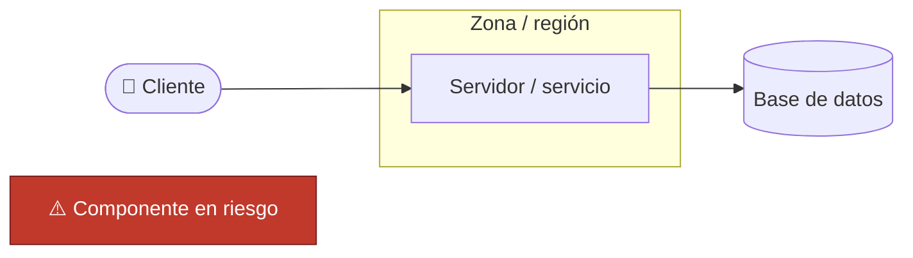
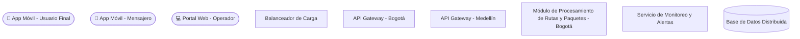
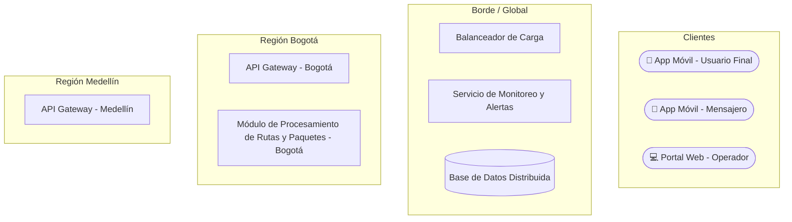
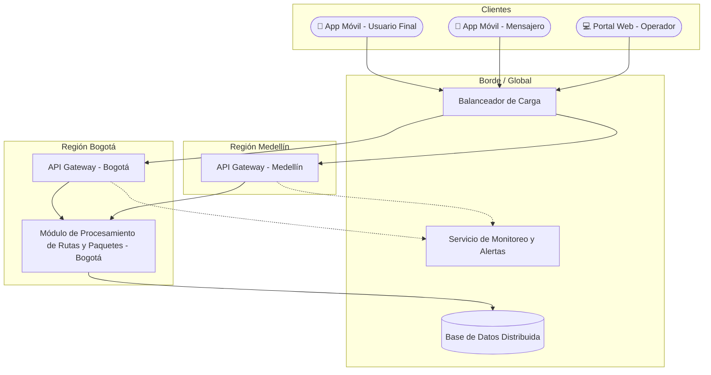
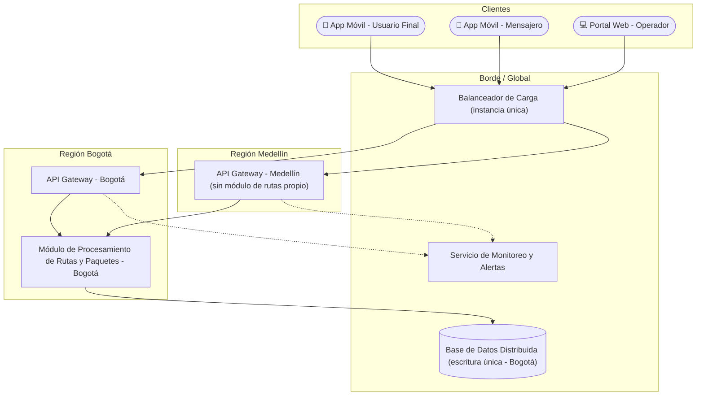
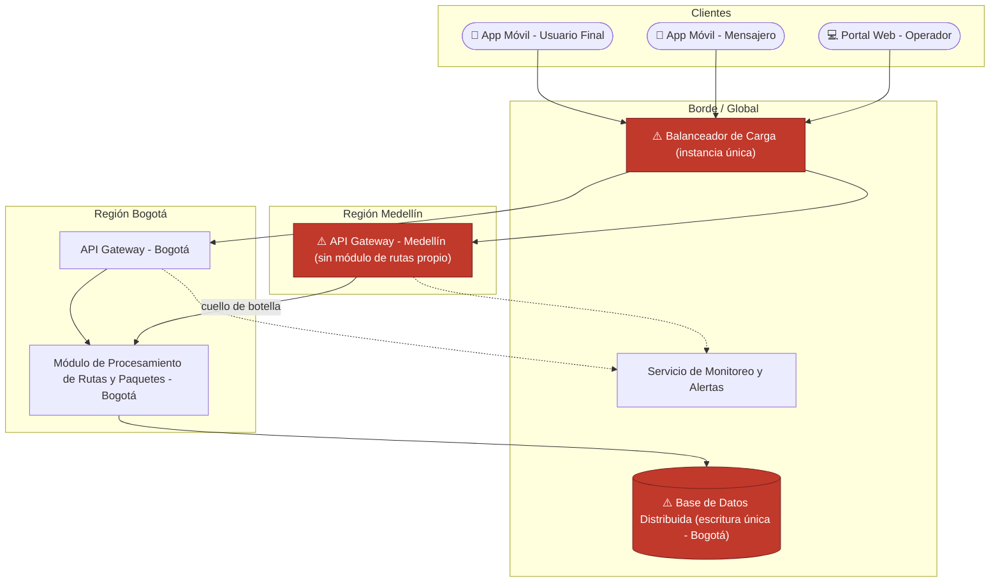
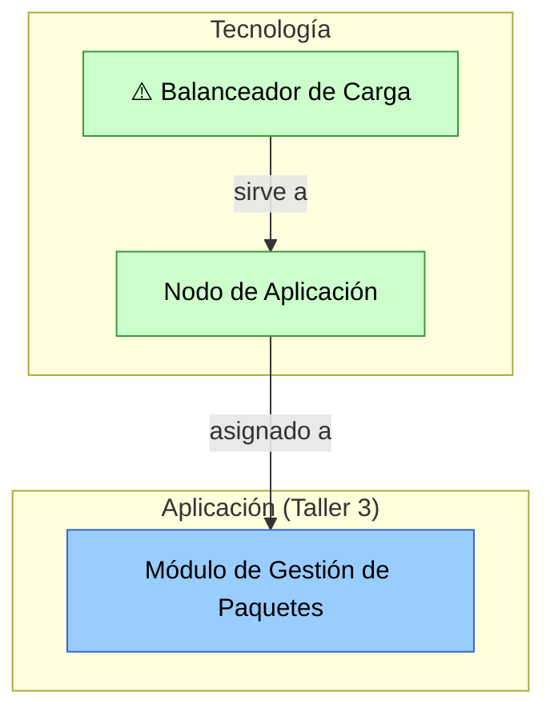

# 🧭 Guía Paso a Paso: Mapa de Infraestructura y Diagnóstico Técnico

Esta guía complementa el `README.md` del taller. Su objetivo es que, antes de construir el mapa de infraestructura de RedExpress en clase (Parte 1) o el del cliente real (Parte 2), el equipo tenga una referencia clara de la notación y de la metodología para pasar de un inventario de componentes a un diagnóstico técnico priorizado.

Los diagramas de ejemplo de esta guía están escritos en [Mermaid](https://mermaid.js.org/) y se renderizan automáticamente al ver este archivo en GitHub. Úselos como referencia de método — el entregable final debe hacerse con la herramienta visual que prefiera (draw.io, papel, etc.), según lo indicado en el `README.md`.

---

## 1. Leyenda de notación

| Elemento | Forma | Uso |
|---|---|---|
| Cliente (app/dispositivo) | Óvalo | Punto de entrada del usuario, mensajero u operador |
| Servidor / servicio | Rectángulo | Componente de cómputo (API Gateway, módulo de procesamiento, etc.) |
| Base de datos | Cilindro | Almacenamiento persistente |
| Zona / región / capa | Subgrafo con borde punteado | Agrupación geográfica o lógica de componentes |
| Componente en riesgo | Rectángulo rojo con ⚠️ | Elemento diagnosticado como punto único de falla, cuello de botella o límite de escalabilidad |

---

## 2. Metodología en 5 pasos

A diferencia de un diagrama puramente estructural, este taller pide un **mapa + un diagnóstico**. Los primeros 3 pasos construyen el mapa; los últimos 2 lo convierten en un análisis de riesgos.

1. **Identificar componentes** — liste los servidores, servicios, bases de datos, balanceadores y demás piezas de infraestructura que soportan el sistema.
2. **Agrupar por zona/capa** — clasifique los componentes por capa (cliente, aplicación, datos) y/o por zona geográfica, y trace el límite de cada agrupación.
3. **Conectar los componentes** — trace las conexiones de red entre componentes, indicando la dirección del tráfico.
4. **Marcar redundancia y capacidad** — para cada componente crítico, indique si tiene redundancia (una instancia única es un riesgo) o si es un cuello de botella conocido.
5. **Diagnosticar y priorizar** — a partir de las marcas del paso anterior, identifique los riesgos (puntos únicos de falla, cuellos de botella, límites de escalabilidad) y priorícelos por impacto.

---

## 3. Ejemplo guiado: Mapa de infraestructura de RedExpress

### Paso 1 — Identificar componentes

Del caso base se extraen los componentes de infraestructura: los tres puntos de entrada de cliente, el balanceador de carga, los API Gateway regionales, el módulo de procesamiento de rutas y paquetes, el servicio de monitoreo y alertas, y la base de datos distribuida. Aún no se agrupan ni se conectan.

### Paso 2 — Agrupar por zona/capa

Se agrupan los componentes en cuatro zonas: **Clientes**, **Borde / Global** (lo que atiende a todas las regiones por igual), **Región Bogotá** y **Región Medellín**. Esta agrupación es la que después permite diagnosticar riesgos de escalabilidad geográfica.

### Paso 3 — Conectar los componentes

Se traza el tráfico: los clientes entran por el balanceador, que enruta a cada API Gateway regional. Como Medellín no tiene su propio módulo de procesamiento, su tráfico de rutas depende del módulo de Bogotá. Ambas regiones escriben en la misma base de datos y reportan al servicio de monitoreo.

### Paso 4 — Marcar redundancia y capacidad

Se anota junto a cada componente crítico si tiene redundancia o no. El balanceador y la base de datos quedan marcados como **instancia única**; el gateway de Medellín queda marcado como **dependiente de Bogotá** para el procesamiento de rutas.

### Paso 5 — Diagnosticar y priorizar

Con las marcas del paso anterior, se resaltan los componentes en riesgo y se documenta el diagnóstico en una tabla — esta tabla es la base directa del informe técnico que pide la Parte 2 del taller.

**Tabla de diagnóstico:**

| Componente | Riesgo diagnosticado | Categoría | Impacto si ocurre | Prioridad |
|---|---|---|---|---|
| Balanceador de Carga (instancia única) | Punto único de falla | Disponibilidad | Toda la plataforma queda inaccesible | Alta |
| Base de Datos Distribuida (escritura única en Bogotá) | Cuello de botella de latencia | Rendimiento | Lentitud en el rastreo en tiempo real para mensajeros fuera de Bogotá | Alta |
| Región Medellín sin módulo de rutas propio | Límite de escalabilidad geográfica | Escalabilidad | No se puede atender el crecimiento de demanda en Medellín sin saturar Bogotá | Media |

Vea este mapa y diagnóstico en un diagrama interactivo (clic sobre cada componente en riesgo) en [`clase/visualizacion-infraestructura.html`](visualizacion-infraestructura.html).

---

## 4. Errores comunes a evitar

| Error frecuente | Por qué es un problema | Cómo corregirlo |
|---|---|---|
| Dibujar todos los componentes sin agrupar por capa o zona | Dificulta ver dónde están concentrados los riesgos geográficos | Agrupe por región/capa como en el Paso 2 |
| Listar componentes sin marcar redundancia | El diagnóstico de puntos únicos de falla se vuelve una suposición, no un hallazgo del mapa | Indique junto a cada componente crítico si tiene redundancia o es instancia única |
| Diagnóstico sin relación directa con el mapa dibujado | El informe queda desconectado del modelo, y la rúbrica pide justificación técnica basada en el mapa | Cada riesgo del informe debe señalar el componente exacto del mapa que lo origina |
| Confundir "cuello de botella" con "punto único de falla" | Son riesgos distintos: uno es de rendimiento, otro es de disponibilidad total | Clasifique cada hallazgo en una categoría (disponibilidad, rendimiento, escalabilidad) como en la tabla de diagnóstico |

---

## 5. Checklist de autoevaluación antes de entregar

- [ ] Todos los componentes de infraestructura relevantes están representados.
- [ ] Los componentes están agrupados por zona/región o capa.
- [ ] Cada conexión relevante entre componentes está trazada.
- [ ] Los componentes críticos indican si tienen redundancia o son instancia única.
- [ ] Cada riesgo diagnosticado está clasificado (disponibilidad, rendimiento o escalabilidad) y priorizado.
- [ ] El diagnóstico hace referencia explícita a los componentes del mapa, no a afirmaciones genéricas.

---

## 6. Vista ArchiMate equivalente

Los componentes del mapa de infraestructura mapean a la **capa de Tecnología** de ArchiMate (ver la [Guía de Notación ArchiMate](https://github.com/CesarAVegaF312/AREM-ArchiMate/blob/main/guia_notacion_archimate.md)): servidores y balanceadores son **Nodes/Devices**, y cada uno se conecta al **Application Component** (Taller 3) que aloja mediante la relación **Assignment**.

El componente marcado como riesgo en la tabla de diagnóstico (Paso 5) es exactamente el mismo `Device`/`Node` que después, en el Taller 7, se convierte en el origen de un **Gap** de la capa de Implementación y Migración — la trazabilidad no se pierde entre talleres, solo cambia la capa de ArchiMate en la que se mira.

---

_Esta guía hace parte del Taller 4 de Mapa de Infraestructura y Diagnóstico Técnico — curso Arquitectura Empresarial, Universidad de La Sabana._
